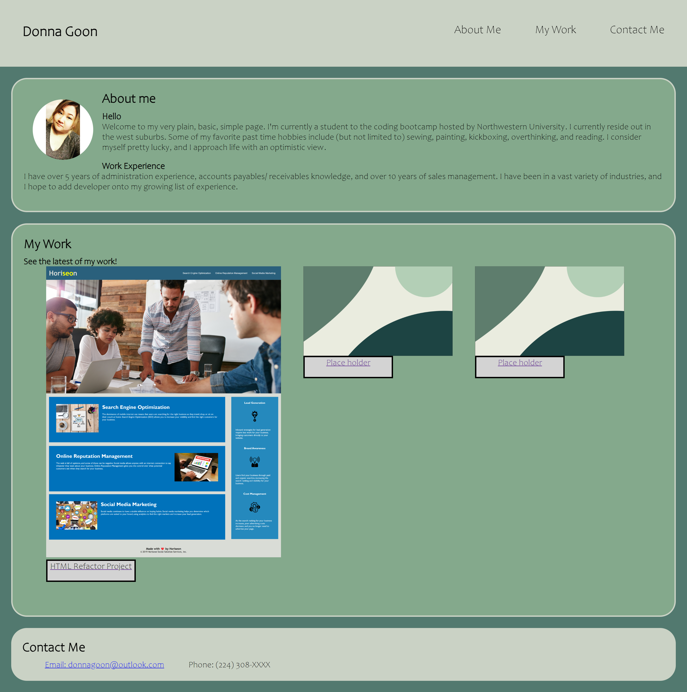

# Donna Goon's Portfolio

Hello, and welcome to my portfolio. As a student of NWU's coding bootcamp, we are tasked to create a porfolio to showcase our work and application to the real world. 

As you navigate through the webpage, you will find information about me; my work experience, my interests, and my outlook in life. As I push further into this class, I hope to keep adding more changes to my portforlio. There is also an image of my face.

You will also see my work that I have made.
I have not made much, so I have some images as a placeholder.

At the bottom of my webpage, you will find my contact information. 

### User Story

```
AS AN employer
I WANT to view a potential employee's deployed portfolio of work samples
SO THAT I can review samples of their work and assess whether they're a good candidate for an open position
```


### Acceptance Criteria

Here are the critical requirements necessary to develop a portfolio that satisfies a typical hiring manager’s needs:

```
GIVEN I need to sample a potential employee's previous work
WHEN I load their portfolio
THEN I am presented with the developer's name, a recent photo or avatar, and links to sections about them, their work, and how to contact them
WHEN I click one of the links in the navigation
THEN the UI scrolls to the corresponding section
WHEN I click on the link to the section about their work
THEN the UI scrolls to a section with titled images of the developer's applications
WHEN I am presented with the developer's first application
THEN that application's image should be larger in size than the others
WHEN I click on the images of the applications
THEN I am taken to that deployed application
WHEN I resize the page or view the site on various screens and devices
THEN I am presented with a responsive layout that adapts to my viewport
```

## Webpage Screenshot
You can find my URL: 


## SPECIAL THANKS
````
I would like to give special thanks to my fellow classmates Alejandro Nava and Sherry Kneitz for assitance and moral support with this project. 
````
